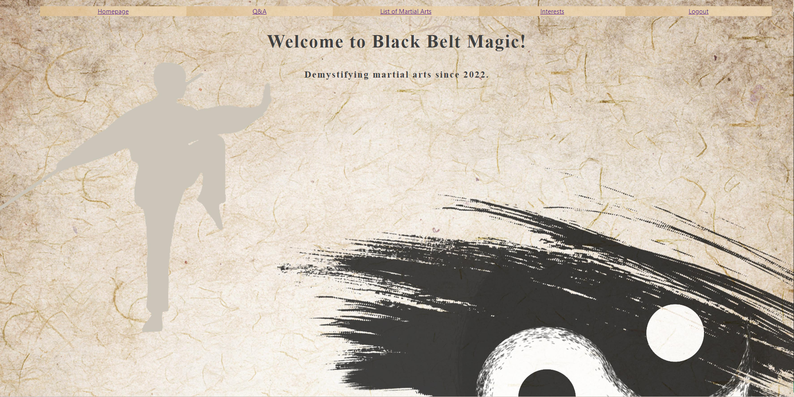

# Black Belt Magic

Black Belt Magic is a Q&A forum intended to quell any confusion a prospective or current martial arts student may have. This is done by connecting students with active martial arts instructors.

<a href="https://www.youtube.com/watch?v=3QTmyuyiu-Q">Click here to view demo</a>

## How It's Made:
**Technologies used:** React.js, HTML, CSS, & JSON Server
Black Belt Magic is powered entirely by React and CSS and all data is fetched from JSON Server. I began the project by setting up the api through JSON using seed data. I developed the React application with routing components and I also extensively used React hooks including useState, useEffect, useNavigate, and useParams. All of the components were rendered primarily with JSX. 

After the application was completely function with full CRUD, I developed the desired aesthetic and layout for the application with vanilla CSS.

## Optimizations:

Finding a method to efficiently display the answers with the corresponding questions was the most challenging portion of the project. Initially, I just had questions and answers being generated as separate lists but there was no way to identify which answer went to the correct question, other than basic context clues. To fix that, I added a dropdown select to the page where answers were created. The dropdown would have the list of questions currently in the database and the user could pick one of those questions. When the user would submit the answer, it would appear on the main Q&A page and would be paired with the question that was selected in the dropdown menu.

## Lessons Learned:

A significant lesson I learned was the value of planning everything before getting started and setting up a solid framework for the project before delving in to the details. Because of this, I had no issues with time management and realized my vision exactly the way I wanted it.

